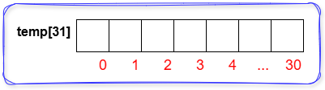
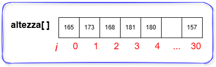

# Array
---

## Definizione:
Un array è una struttura dati **omogenea** e **indicizzata** che consente di memorizzare più valori dello stesso tipo in **posizioni contigue** di memoria.

---

## Problema:
Vogliamo raccogliere un gran numero di dati riconducibili alla stessa grandezza.

### Esempi Tipici:
- Chiediamo l'inserimento delle altezze in centimetri di tutti i componenti della classe.
- Inseriamo i valori della temperatura giornaliera per il mese di settembre

---

### Soluzione deprecata
Dichiaro un numero di variabili pari al numero di valori che devo acquisire.

```c
// codice C
int main(){
int temp1;
int temp2;
int temp3;
//...
//... fino a int temp31
}
```
Questa soluzione alloca un numero di variabili impossibile da gestire.

---

## Soluzione funzionale ed ottimizzata
Utilizzo un Array di 31 celle intere, indicizzate da 0 a 30.
```c
// codice C
#define DIM 31
int main(){
  int temp[DIM];
}
```


---

# Ricorda
Un array è formato da **celle contigue** (una dopo l'altra) identificate da un **indice**.
**L'indice** è **la posizione** della cella, il **contenuto** è il **valore/informazione/dato** presente nella cella.

se indice *i* vale 2 il *contenuto* è 168; se *i* vale 30 il *contenuto* è 157.

---

## Operazioni basilari con Array
- Dichiarazione.
- Inizializzazione.
- Popolamento.
- Stampa.

---
## Dichiarazione di un Array
E' buona norma dichiarare la dimensione come costante con operatore **const** oppure **define**.
```c
// codice C dichiarazione Array - esempio Altezze Classe
#include <stdio.h>
// dimensione o numero di celle dell'Array.
#define DIM 20
int main(){
  // dichiarazione
  int altezza[DIM];
  int i;
  char junk;
}
```

---

## Inizializzazione di un Array
E' un ciclo che assegna ad ogni cella un valore predefinito iniziale. Viene realizzato subito dopo la *dichiarazione*.

```c
// codice C inizializzazione
for(i=0; i<DIM; i++){
  altezza[i] = 0;
}
```

---

## Popolamento Manuale di un Array
E' un ciclo che assegna ad ogni cella un valore richiesto in input all'utente.

```c
// codice C popolamento manuale
for(i=0; i<DIM; i++){
  printf("Inserisci il [%d] valore: ",i+1);
  scanf("%d", &altezza[i]);
  junk = getchar();
}
```
Cambiando la *i* cambia la cella indicizzata che viene utilizzata.

---

## Popolamento Random di un Array
E' un ciclo che assegna ad ogni cella un valore random. (comodo per testing)

```c
// ricordati di includere time.h e stdlib.h

// codice C popolamento automatico con random.
for(i=0; i<DIM; i++){
  // genero altezze da 150 a 190 (intesi come centimetri)
  altezza[i] = 150 + rand(41);
}
```
Cambiando la *i* cambia la cella indicizzata che viene utilizzata.


---

## Stampa valori su singola riga
```c
// codice C stampa valori in riga.
for(i=0; i<DIM; i++){
  printf("%d ", altezza[i]);
}
```
Ogni valore distanzia il successivo con uno spazio; vedi spazio vuoto dopo il *%d*.

---

## Stampa valori in colonna con indice di cella.
```c
// codice C stampa valori in colonna.
for(i=0; i<DIM; i++){
  printf("[%d]= %d", i, altezza[i]);
  printf("\n");
}
```
Ogni riga presenta tra parentesi quadre l'indice *i* in quel momento seguito dal contenuto della cella indicizzata. Ho separato l'andata a capo *'\n'* per comodità, ma poteva essere messa anche nella riga precedente.

---

## Let's try...
- Crea un nuovo file .c
- Dichiara un Array *altezza* di 5 elementi, usa una DIM.
- Inizializza l'Array, tutti i valori iniziali devono essere 0.
- Procedi ad un *popolamento manuale* dell'Array.
- Stampa i valori presenti nell'Array, così verifichi l'avvenuto input.
- Compila *gcc nome_file.c* ed esegui *./a.out*, **funziona?**
- Se si: allora Modifica la DIM da 5 a 10, ricompila ed esegui, tutti i cicli si sono adeguati?

---

<!-- _class: lead -->
## Take a break...

---

## Abbiamo un Array con dati, possiamo effettuare le seguenti operazioni basilari:
- Calcoli (media, valore massimo, valore minimo).
- Ricerca di un valore.

---

## Calcolo del valor medio
```c
// codice C calcolo del valor medio
int totale = 0;
int media = 0; //potevo farla anche float
for(i=0; i<DIM; i++){
  totale = totale + altezza[i];
}
media = totale / DIM;
```
Prima calcolo nella variabile *totale* la somma di tutti i valori presenti, **successivamente e fuori dal ciclo**, divido il totale per *DIM* ottenendo così l'effettivo valor medio assegnandolo a *media*. 

---

## Calcolo del valor massimo
```c
// codice C calcolo del valore massimo.
int max;
max = altezza[0]; // assegno la prima altezza al valore massimo
for(i=1; i<DIM; i++){
  if(altezza[i] > max)
    max = altezza[i];
}
// finito il ciclo in max ho il valore massimo presente, posso stamparlo
```
Errore comune: assegnare alla variabile max un valore iniziale 0 o altro valore fisso, **assegna sempre il valore contenuto nella prima cella** dell'Array. 

---

## Calcolo del valor minimo
```c
// codice C calcolo del valore minimo.
int min;
min = altezza[0]; // assegno la prima altezza al valore minimo
for(i=1; i<DIM; i++){
  if(altezza[i] < min)
    min = altezza[i];
}
// finito il ciclo in min ho il valore minimo presente, posso stamparlo.
```
Errore comune: assegnare alla variabile max un valore iniziale 0 o altro valore fisso, **assegna sempre il valore contenuto nella prima cella** dell'Array. 

---

## Ricerca di un valore
Generalmente per ricerca di un valore in un Array si intende:
- Determinare se è presente oppure no.
- Determinare quante volte compare.
- Determinare in quali celle (indici) compare.

Per gli esempi che seguono, supponiamo di avere il valore da ricercare nella variabile *src* e che sia stato acquisito in input precedentemente.

---

## Presenza oppure no di *src*
```c
// codice C verifica presenza src.
int flag_presente = 0;

for(i=0; i<DIM; i++){ // ciclo di scorrimento del vettore
  //confronto tra contenuto cella e src; se uguali accendo il flag.
  if(altezza[i] == src) 
    flag_presente = 1;
}
if(flag_presente == 1)
  printf("Valore %d presente nell'Array.", src);
else
  printf("Valore %d non presente nell'Array.", src);
```
---

## Conteggio presenze di *src*
```c
// codice C conteggio presenza src.
int cnt_presente = 0;

for(i=0; i<DIM; i++){ // ciclo di scorrimento del vettore
  //confronto tra contenuto cella e src; se uguali accendo incremento il contatore.
  if(altezza[i] == src) 
    cnt_presente = cnt_presente + 1;
}
printf("Il valore %d è presente %d volta/e.", src, cnt_presente);
```
Inizializzo un contatore a 0, quindi eseguo un ciclo su tutto il vettore e se trovo src aumento il contatore.

---

## Indici in cui compare *src*
```c
// codice C per mostrare dove compare src.
printf("Il valore %d compare ai seguenti indici: ", src);
for(i=0; i<DIM; i++){ // ciclo di scorrimento del vettore
  //confronto tra contenuto cella e src; se uguali stampo l'indice i.
  if(altezza[i] == src) 
    printf("%d ", i;)
}
```
Ogni volta che trovo che il contenuto della cella è uguale ad *src* stampo l'indice.

---

## Let's try...
- Calcola e stampa l'altezza minima presente nell'Array.
- Calcola e stampa l'altezza media presente nell'Array.
- Richiedi in input un'altezza, calcola e comunica quante volte compare nell'Array.
- Avendo calcolato precedentemente l'altezza media, calcola e comunica in quali celle è presente un valore **inferiore** all'altezza media.

---

<!-- _class: lead -->
## That's all Folks!
