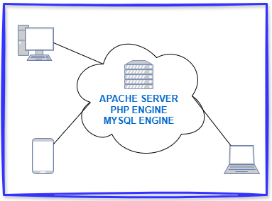

# Migriamo da C a PHP
### da App Locali a Web Dinamico

---

### PHP?

PHP inizialmente acronimo di Personal Home Page è ora l'acronimo di <ins>Hypertext Preprocessor.</ins> Nasce nel 1994 grazie all'opera del danese Rasmus Lerdorf e dopo 32 anni siamo alla versione 8. E' un linguaggio server-side tra i più diffusi al mondo.
Storia di PHP: [Fonte Wikipedia](https://it.wikipedia.org/wiki/PHP)

---

#### I punti cardine del linguaggio si riassumono in:
**Server-Side Scripting**
<div class="columns">
<div>
PHP is executed on the server, which means it runs on the web server to generate dynamic content, such as web pages, before sending it to the user's browser.
</div>
<div>



</div>
</div>

---

**Embedded in HTML**
PHP can be embedded directly into HTML code, making it convenient to add dynamic behavior to web pages.

```php
<!-- file: pagina.php -->
<html>
    <head>
    <body>
    <h1>Titolo della pagina</h1>
    <?php
        echo('Hello World');
    ?>
    </body>
</html>
```
---

**Cross-Platform**
PHP works on various operating systems including Linux, Windows, and macOS, and it supports most web servers such as Apache and Nginx.

**Integration with Databases**
PHP has built-in support for numerous databases like MySQL, PostgreSQL, Oracle, and SQLite, which makes it ideal for creating data-driven websites.

---

**Extensive Library Support**
PHP has a wide range of built-in functions and libraries for tasks like string manipulation, file handling, session management, and interacting with APIs.

**Community and Frameworks**
There is a large community of developers and frameworks like Laravel, Symfony, and CodeIgniter, which help streamline development and promote best practices.

---

## Gli usi consolidati

* **Dynamic Website Content:** Generate content based on user input or database queries.
* **Forms Handling:** Collect and process data submitted via web forms.
* **Session Management:** Track user sessions for login systems or shopping carts.
* **Content Management Systems (CMS):** Platforms like WordPress, Joomla, and Drupal are built with PHP.
* **APIs and Web Services:** Create and consume APIs to enable frontend-backend communication.