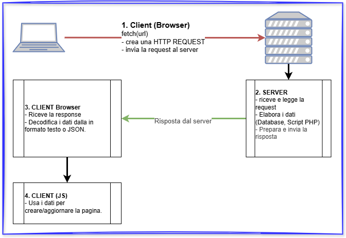

# JSON
### scambio dati tra sistemi diversi

---

### JSON?

JSON è un formato testuale semplice da leggere e scrivere, progettato per trasferire dati tra sistemi diversi. È indipendente dalla piattaforma e compatibile con la maggior parte dei linguaggi di programmazione.

---

### Problema: Scambiare dati tra sistemi diversi.

Ipotiziamo di dover passare dati estrapolati da un Database senza dare accesso diretto al Database stesso.
<br>
**La soluzione è:**
- Creare uno script(sul server) che estrapola i dati dal DB.
- *codificare* i dati in un formato semplice, testuale, ed interpretabile (JSON) da chi li riceve.
- Restituire i dati al browser che li richiede.

---
#### La struttura di un JSON:
JSON si basa su due strutture principali:

- **Oggetti**: racchiusi tra { }, contengono **coppie chiave:valore**.
- **Array**: racchiusi tra [ ], contengono liste ordinate di valori, liste di oggetti JSON.

I valori possono essere stringhe, numeri, booleani, null, oggetti o array.

---

**Esempio di singolo oggetto JSON:**

```json
{
  "name": "Mario",
  "surname": "Rossi",
  "age": 28,
  "active": true,
  "languages": ["it", "en"]
}
```
---

### A cosa serve quindi un JSON?
JSON è usato ovunque nel web:

- API e comunicazione client‑server
- Configurazioni di servizi cloud
- Database documentali
- Applicazioni web e mobile

JSON è oggi uno dei formati più diffusi per lo scambio di dati grazie alla sua leggerezza e compatibilità.

---

### Come realizziamo file JSON:
Come da definizione è un formato **testuale** quindi possiamo produrlo in due modi principali:
- Editor di testo come VSCode, Notepad++, Atom, etc...
- Da script PHP/Java/altro che permettano di restituire uno **stream di caratteri** sia esso come puro file di testo oppure uno **stream client-server HTTP**.

---

### La funzione di riferimento è: fetch()

La funzione *fetch()* in JavaScript è un metodo globale che consente di effettuare **richieste HTTP**, da client, e gestire le risposte.

Per effettuare una richiesta, si deve passare una Request object o **una stringa contenente la URL**.

La funzione *fetch()* restituisce una promessa che viene risolta con una **Response object** rappresentando la **risposta del server**. Si può estrarre il corpo della risposta in vari formati, come **testo e JSON**, utilizzando i metodi appropriati sulla Response.

---
<!-- _class: lead -->
### Schema temporale della Fetch


---
### Esempio pratico:
Supponi di avere questo file json: amici.json
```json
// codice JSON - Array di 4 oggetti JSON perchè racchiusi tra []
[
    { "nome": "Marco", "cognome": "Bianchi", "sesso": "m", "anni": 18 },
    { "nome": "Alberto", "cognome": "Rossi", "sesso": "m", "anni": 21 },
    { "nome": "Maria", "cognome": "Santaguida", "sesso": "f", "anni": 20 },
    { "nome": "Lucilla", "cognome": "Boari", "sesso": "f", "anni": 23 }
]
```
---
##### Parte Javascript sul browser del client.
```javascript
async function caricaAmiciJSON(){
  /* Fetch esegue una HTTP Request
  chiedendo la risorsa 'amici.json' al server
    -> riceve i dati come response.*/
  const response = await fetch('amici.json');
  /* estrapola di dati dalla response nel formato JSON.
  Attenzione: dobbiamo essere sicuri
  che il server restituisca dati nel formato JSON.*/
  const vetAmici = await response.json();

  // view è una div creata nella pagina html.
  let v = document.querySelector("#view");
  v.innerHTML += vetAmici.length;
  v.innerHTML += "<br />";
  for(let i=0; i<vetAmici.length; i++){
    v.innerHTML += vetAmici[i].nome + " " + vetAmici[i].cognome +
    " " + vetAmici[i].sesso + " " + vetAmici[i].anni + "<br />";
  }
}
```
---
### Fondamentale da ricordare:
- Fetch esegue una HTTP-Request, **deve** essere utilizzata chiamando un web-server (es. Apache).
- La response **può essere convertita in JSON se**, e solo se, **il flusso di dati ricevuto dal server è sintassi JSON**.
- La pagina sul browser del client **deve essere gestita con Javascript**.
- Fetch **implica l'uso di await e async**, che tratteremo in seguito.

---
<!-- _class: lead -->
# That's all Folks!